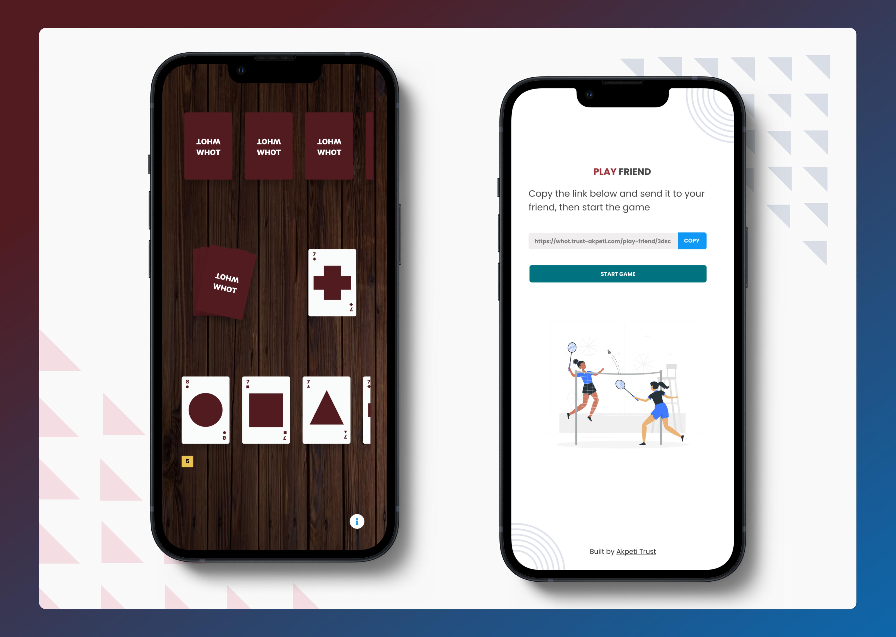

# Naija Whot (Open Source)

<br />



<br />

This is a game of Naija Whot built for the web. It has both single and multiplayer features. You can check it out [live here](https://whot.trust-akpeti.com).

## Technologies ⚙

Front end:

- React
- Redux
- [React-flip-toolkit (for animations)](https://github.com/aholachek/react-flip-toolkit)
- SCSS

Back end

- socket.io (Running on Node)

## Running project 🚀

The repo has three branches:

- main: This holds the front end React code.
- server: This holds the socket server code.
- gh-pages: For Github Pages hosting.

To run the project locally:

1. Clone the main branch

   ```
   git clone https://github.com/AkpetiTrust/whot.git
   ```

2. Run the front end using npm

   ```
   npm install && npm start
   ```

3. Clone the server branch

   ```
   git clone -b server https://github.com/AkpetiTrust/whot.git
   ```

4. Run the server using node

   ```
   node index.js
   ```

## Contributing 💻

Contributions are surely welcome! You can check out the [public roadmap](https://github.com/AkpetiTrust/whot/wiki/Public-Roadmap) to see the feature ideas in store for the game, then [create a new issue](https://github.com/AkpetiTrust/whot/issues/new/choose) if you're interested in contributing to any. If the idea you have isn't in the roadmap, still feel free to create a new issue to talk about the idea.
